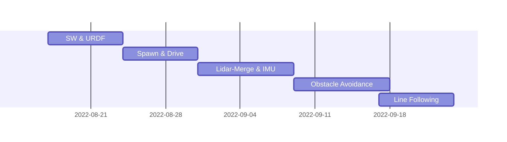

Racecar Eklavya
===


## Table of Contents
 - [About the Project](#about-the-project)
    - [Tech Stack](#tech-stack)
    - [File Structure](#file-structure)
    - [ODG-PF Algorithm Flowchart](#ODG-PF-Algorithm-Flowchart) 
 - [Usage and Guide](#usage-and-guide)
    - [Prerequisites and Installations](#prerequisites-and-installations)
    - [Usage](#usage)
 - [Project Timeline](#project-timeline)


## About the Project

Obstacle Avoidance Racecar is an autonomous robot designed in solidworks and simulated and tested in ros, gazebo, rviz, etc. It's main objective is to avoid obstacle using [ODG-PF](https://www.hindawi.com/journals/jat/2018/5041401/) algorithm and line following through Opencv and PID .
more about the project [here]()

 ### Tech Stack
   *  Solidworks
   *  ROS Noetic 
   *  GAZEBO Sim
   *  Pyhton3
   *  RVIZ

 ### File Structure 


     📦racecar_eklavya
      ┣ 📂assets                           #contains gifs, videos and images of the results
      ┣ 📂cfg                              #config files for the sensors
      ┣ 📂include                          #include files for the plugins
      ┃ ┗ 📂vitarana_drone
      ┃ ┃ ┣ 📜gazebo_edrone_propulsion.h   #propulsion plugin include
      ┃ ┃ ┣ 📜gazebo_ros_gps.h             #gps plugin include
      ┣ 📂launch                           #launch files
      ┃ ┗ 📜drone.launch
      ┣ 📂models                           #files and meshes used to render the model
      ┃ ┗ 📂edrone
      ┃ ┃ ┣ 📂materials
      ┃ ┃ ┣ 📂meshes
      ┃ ┃ ┣ 📜model.config
      ┃ ┃ ┗ 📜model.sdf
      ┣ 📂msg                              #contains custom messages which are used to control drone functions
      ┣ 📂scripts                          #python programs used to run the drone
      ┃ ┣ 📂__pycache__
      ┃ ┣ 📜control.py                     #brain of the drone, this file needs to be executed
      ┃ ┣ 📜pid.py                         #contains the math needed to stabilise the drone
      ┣ 📂src                              #contains custom plugins used with the drone
      ┃ ┣ 📜gazebo_edrone_propulsion.cpp
      ┃ ┗ 📜gazebo_ros_gps.cpp
      ┣ 📂worlds                           #world files
      ┃ ┣ 📜drone.world
      ┣ 📜CMakeLists.txt
      ┣ 📜README.md
      ┗ 📜package.xml
 
 ### ODG-PF Algorithm Flowchart
---


## Usage and Guide

### Prerequisites and Installations
___

 ####  - Tested upon [UBUNTU 20.04](https://ubuntu.com/server/docs/installation)
 ####  - [ROS Noetic](http://wiki.ros.org/noetic/Installation/Ubuntu)
 ####  - [Gazebo](https://classic.gazebosim.org/tutorials?tut=install_ubuntu&cat=install#InstallGazebousingUbuntupackages)

### Usage
___
1. git clone the main repo in the /src of your catkin_ws using command

```
cd ~/catkin_ws/src
```

```
git clone https://github.com/sameergupta4873/racecar_eklavya.git
```

2. git clone the [ira_laser_tools](https://github.com/sameergupta4873/ira_laser_tools.git) branch repo in the /src of your catkin_ws using

```
git clone https://github.com/sameergupta4873/ira_laser_tools.git
```

3. cd into your catkin_ws and run command 

```
cd ~/catkin_ws
```

```
catkin_make
```

```
source devel/setup.bash
```

```
roslaunch racecar_eklavya world.launch
```

4. open new terminal again cd into catkin_ws again run command 

```
source devel/setup.bash
```

```
roslaunch ira_laser_tools laserscan_multi_merger.launch
```

5. finally to avoid obstacles again open a new terminal cd into catkin_ws and run command

```
cd ~/catkin_ws
```

```
source devel/setup.bash
```

```
rosrun racecar_eklavya obstacle_avoidance.py
```

6. robot should start moving and avoiding obstacles

Results and Demo
---

Future Work
---
  -☑️ Desigining of Robot in Solidworks
  -☑️ Application of Differential Drive 
  -☑️ Calculating Min-Angle for Obstacle Avoidance using ODG-PF
  -☑️ Acheiving Min-Angle Using IMU
  -☑️ Line Following using OpenCv and PID 
  -◻️ Acheveing Line Following and Obstacle Avoidance simultaneously

Contributors
---
- [Sameer Gupta](https://github.com/sameergupta4873)
- [Yash Rajput](https://github.com/Yashrajput9232)

Acknowledgements and Resources
---
 - [SRA-VJTI](https://github.com/SRA-VJTI)  Eklavya 2022
 - [the Basic Science Research Program through the National Research Foundation of Korea (NRF)](https://www.nrf.re.kr/eng/index) for ODG-PF resource paper .
 - [IRALABS](https://github.com/iralabdisco) for template for Laser Data Merging .
 - Our Mentors [Toshan Luktuke](https://github.com/toshan-luktuke) , [Mark Koothor](https://github.com/marck3131) and [Aryaman Shardul](https://github.com/Aryaman22102002) for guiding and helping whenever we were stuck .


Project Timeline
---



###### tags : `ROS` `GAZEBO` `RVIZ` `PYTHON` `PID` `SOLIDWORKS` `OPENCV`
