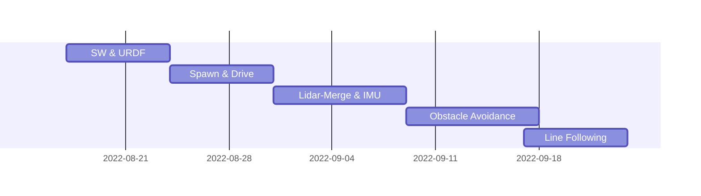

Racecar Eklavya
===


## Table of Contents
 - [About the Project](#about-the-project)
    - [Tech Stack](#tech-stack)
    - [File Structure](#file-structure)
    - [Project Flow](#project-flow)
    - [ODG-PF Algorithm Flowchart](#ODG-PF-Algorithm-Flowchart) 
 - [Usage and Guide](#usage-and-guide)
    - [Prerequisites and Installations](#prerequisites-and-installations)
    - [Usage](#usage)
 - [Results and Demo](#results-and-demo)
 - [Future Work](#future-work)
 - [Contributors](#contributors)
 - [Acknowledgements and Resources](#acknowledgements-and-resources)
 - [Project Timeline](#project-timeline)


## About the Project

- Obstacle Avoidance Racecar is an autonomous robot designed in Solidworks and simulated and tested in ROS, Gazebo, RViz, etc. It's main objective is to avoid obstacle using [ODG-PF](https://www.hindawi.com/journals/jat/2018/5041401/) algorithm and line following through [OpenCV](https://opencv.org/) and [PID](https://en.wikipedia.org/wiki/PID_controller).
- More about the project [here](https://github.com/sameergupta4873/racecar_eklavya/blob/main/report.pdf).

 ### Tech Stack
   *  [Solidworks](https://www.solidworks.com/)
   *  [ROS Noetic](http://wiki.ros.org/noetic)
   *  [GAZEBO Sim](https://classic.gazebosim.org/)
   *  [Python3](https://www.python.org/about/)
   *  [RVIZ](http://wiki.ros.org/rviz)

 ### File Structure 


     📦racecar_eklavya
      ┣ 📂config 
      ┃ ┗ 📜joint_names_racecar_updated_urdf.yaml                       
      ┣ 📂controllers
      ┃ ┣ 📜diff_drive.py                   
      ┃ ┣ 📜imu_reading.py                       
      ┃ ┣ 📜laser_range.py
      ┃ ┣ 📜line_follower.py
      ┃ ┣ 📜obstacle_avoidance.py
      ┃ ┗ 📜obstacle_plus_line.py         
      ┣ 📂launch                           
      ┃ ┣ 📜robot_description.launch
      ┃ ┗ 📜model.sdf                 
      ┣ 📂meshes
      ┃ ┣ 📜base_link.STL                 
      ┃ ┣ 📜FLW_Link.STL                     
      ┃ ┣ 📜FRW_Link.STL
      ┃ ┣ 📜hokuyo.dae
      ┃ ┣ 📜RLW_Link.STL
      ┃ ┗ 📜RRW_Link.STL
      ┣ 📂urdf
      ┃ ┣ 📜my_robot.gazebo          
      ┃ ┣ 📜my_robot.xacro                   
      ┃ ┣ 📜racecar_updated_urdf.urdf
      ┃ ┗ 📜racecar_updated_urdf.csv                     
      ┣ 📂worlds                        
      ┃ ┣ 📜world01.world 
      ┃ ┣ 📜world02.world                    
      ┃ ┗ 📜world03.world                      
      ┣ 📜CMakeLists.txt
      ┣ 📜README.md
      ┣ 📜export.log
      ┗ 📜package.xml
 ### Project Flow
---

 
 ### ODG-PF Algorithm Flowchart
---


## Usage and Guide

### Prerequisites and Installations
___

 ####  - Tested upon [UBUNTU 20.04](https://ubuntu.com/server/docs/installation)
 ####  - [ROS Noetic](http://wiki.ros.org/noetic/Installation/Ubuntu)
 ####  - [Gazebo](https://classic.gazebosim.org/tutorials?tut=install_ubuntu&cat=install#InstallGazebousingUbuntupackages)

### Usage
___
1. git clone the main repo in the /src of your catkin_ws using command

```
cd ~/catkin_ws/src
```

```
git clone https://github.com/sameergupta4873/racecar_eklavya.git
```

2. git clone the [ira_laser_tools](https://github.com/sameergupta4873/ira_laser_tools.git) branch repo in the /src of your catkin_ws using

```
git clone https://github.com/sameergupta4873/ira_laser_tools.git
```

3. cd into your catkin_ws and run command 

```
cd ~/catkin_ws
```

```
catkin_make
```

```
source devel/setup.bash
```

```
roslaunch racecar_eklavya world.launch
```

4. open new terminal again cd into catkin_ws again run command 

```
source devel/setup.bash
```

```
roslaunch ira_laser_tools laserscan_multi_merger.launch
```

5. finally to avoid obstacles again open a new terminal cd into catkin_ws and run command

```
cd ~/catkin_ws
```

```
source devel/setup.bash
```

```
rosrun racecar_eklavya obstacle_avoidance.py
```

6. robot should start moving and avoiding obstacles

### Line Following 

7. to stop the running script 
```
CTRL + C 
```
8. Start the line follower script
```
rosrun racecar_eklavya line_follower.py
```
 

Results and Demo
---


https://user-images.githubusercontent.com/95731926/195905534-36b4bf22-bf20-4839-8e3b-0d61bfe03c86.mp4

https://user-images.githubusercontent.com/95731926/195905945-6cd707a3-23ca-4dc1-bdb5-43566de89396.mp4


Future Work
---
- [x] Achieving Line Following using OpenCV and PID
- [ ] Acheveing Line Following and Obstacle Avoidance simultaneously

Contributors
---
- [Sameer Gupta](https://github.com/sameergupta4873)
- [Yash Rajput](https://github.com/Yashrajput9232)

Acknowledgements and Resources
---
 - [SRA-VJTI](https://github.com/SRA-VJTI)  Eklavya 2022
 - [the Basic Science Research Program through the National Research Foundation of Korea (NRF)](https://www.nrf.re.kr/eng/index) for ODG-PF resource paper .
 - [IRALABS](https://github.com/iralabdisco) for template for Laser Data Merging .
 - Our Mentors [Toshan Luktuke](https://github.com/toshan-luktuke) , [Mark Koothoor](https://github.com/marck3131) and [Aryaman Shardul](https://github.com/Aryaman22102002) for guiding and helping whenever we were stuck .


Project Timeline
---


